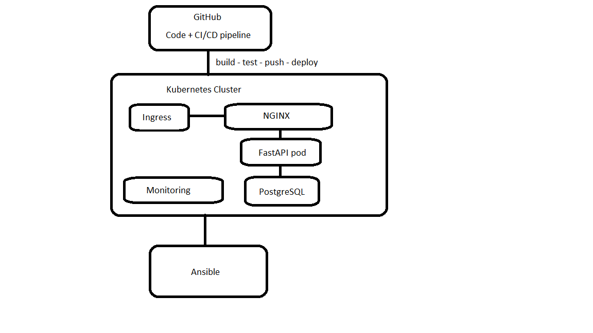

# Лабораторная работа 0
Данный цикл лабораторных работ нацелен на создание тестового стенда.  
Цель работ - изучить DevOps методологию и инструменты, получить практические навыки на базовом уровне.  
В текущей лабораторной работе будет представлена архитектура всего проекта, к которой я буду стремиться в течение всего цикла работ.  
Весь текст лабораторных работ написан в obsidian, возможно неправильное отображение различных элементов в github.  
Для написания работ я использую ИИ! ChatGPT составляет план всего проекта и отдельно каждой лабораторной работы, так же он написал простой backend + frontend.   
В ходе изучения инструментов, создания сред, написания тех или иных инструментов/компонентов ИИ не будет использован!  
Важная ремарка - от некоторых преждевременных решений(в т.ч. конечной архитектуры) возможно придется отказаться в будущем по тем или иным причинам, поэтому некоторая информация может быть неактуальна.  
Так же описание работ чаще всего производилось уже сильно позже практической части, поэтому некоторые лаб работы могут иметь одинаковую дату(это дата написания документа!).  
Архитектура проекта к которой я стремлюсь:  
  
Она же, в текстовом формате:  
```
                        ┌──────────────────────────┐
                        │        GitHub            │
                        │  (код + CI/CD pipeline)  │
                        └────────────┬─────────────┘
                                     │
                                     ▼
                           CI/CD Pipeline
                     (build → test → push → deploy)
                                     │
                                     ▼
 ┌──────────────────────────────────────────────────────────┐
 │                   Kubernetes Cluster                     │
 │                                                          │
 │  ┌───────────────┐      ┌──────────────────────────┐     │
 │  │   Ingress     │ ---> │        NGINX             │     │
 │  └───────────────┘      └────────────┬─────────────┘     │
 │                                      │                   │ 
 │                               ┌──────▼───────┐           │
 │                               │  FastAPI Pod │           │
 │                               └──────┬───────┘           │
 │                                      │                   │
 │                               ┌──────▼────────┐          │
 │                               │  PostgreSQL   │          │
 │                               └───────────────┘          │
 │                                                          │
 │  ┌──────────────────────────────────────────────────┐    │
 │  │ Monitoring Stack                                 │    │
 │  │  Prometheus  →  Grafana                          │    │
 │  └──────────────────────────────────────────────────┘    │
 └──────────────────────────────────────────────────────────┘

                ▲
                │
        Ansible (автоматизация серверов)

```