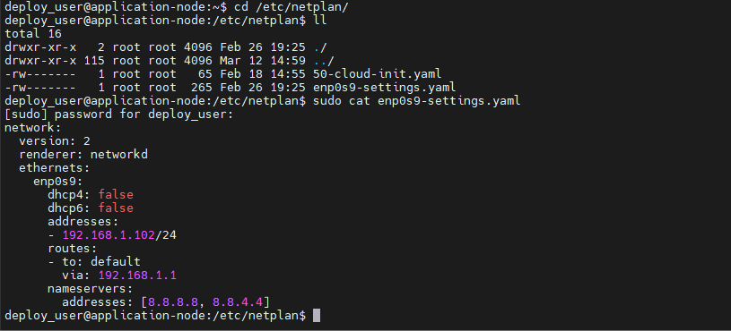

## Лабораторная работа 1
Проектирование локального стенда и сетевой архитектуры.  
Инструменты: VirtualBox, Ubuntu, SSH, NAT.  

Скачал с официального сайта Ubuntu 24.04(server(no GUI)) LTS, создал два экземпляра Ubuntu в VirtualBox.  

На данный момент я знал что такое снимки(snapshot) но совсем про них забыл, поэтому бэкапа чистой системы нет ни у одного сервера.  
На обоих серверах был добавлен специальный юзер для деплоя, и для него были настроены права.  
Настроил у обеих машин виртуальную внутреннюю сеть.     
Настройка сетевых интерфейсов проводилась с помощью утилиты ifconfig.  
Проставил статические ip адреса, пропинговал обе машины.  
Через время я понял что адреса слетают и ничего не работает как я хочу, поэтому я пошел гуглить. Поиск привел меня к netplan и его настройке.
Для подключения к серверу по ssh через клиент с хоста был настроен сетевой мост, кроме того сам ssh был настроен - отключены root коннекты, добавлены ssh ключи и в связи с этим отключены подключения через логин/пароль.  
Вот так выглядит .yaml файл netplan:  
