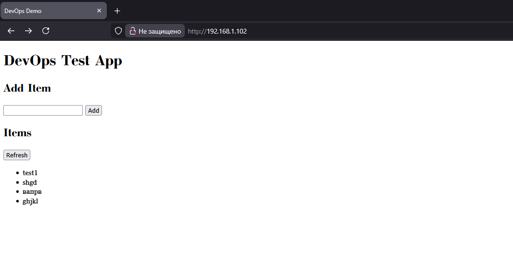

## Лабораторная работа 2  
#### Backend, Frontend, DB.
На данный момент вся работа ведется исключительно на одном сервере(app-node).  
Строго говоря, данная работа вообще нисколько не затрагивала работу на самом сервере, т.к. сначала я все целиком и полностью собирал и запускал на хосте, чтобы имитировать процесс деплоя(якобы я как разработчик у себя все это дело запустил и собрал, отправил в гит и потом уже оттуда произошел деплой на сервер.)  
Сначала я думал самому написать минимальный бэк имитируя бизнес логику, потом решил отдать это все на аутсорс ИИ, т.к. основная задача цикла это именно админ/девопс практики и методы.  
Таким образом получился маленький бэк на Python FastApi с небольшим количеством ручек, фронт представленный html страничкой с вводом/выводом данных из бд.  
Вот так все это выглядит:  
  
Код лежит на пару директорий выше этого md файла в папках backend и frontend соответственно.  
PostgreSQL сервер располагается на этом же сервере(что не является лучшей практикой, но все же.), для полноценной работы была создана маленькая бд с одной таблицей, все права были выданы новому юзеру(в бд), подключение к бд происходит по локальной сети (вероятно в будущем это приведет к проблемам, т.к. все планируется обернуть в докер).  
Все данные для подключения, да и в целом вся уязвимая информация содержится в .env файле.  
