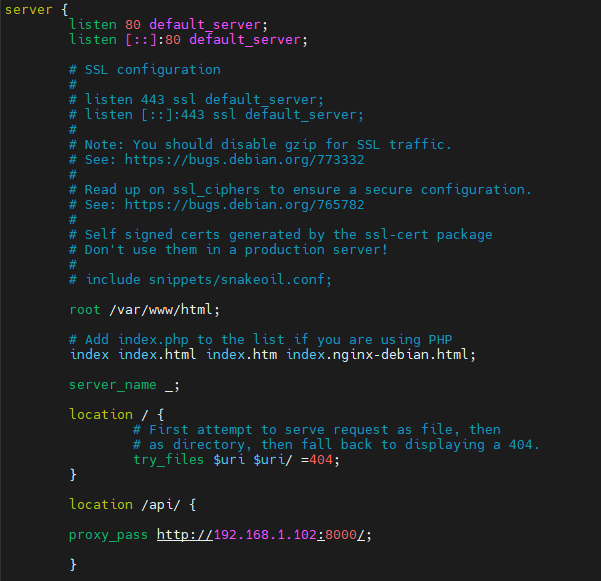

## Лабораторная работа 3  
#### GIT, NGINX   
В прошлой работе была описана полезная нагрузка на сервер, теперь как все это дело туда попало и запускалось.  
Сначала был создан git репозиторий(этот), далее на сервер был установлен гит, была выбрана директория для деплоя и произведен git clone по ssh(мне было лень вспоминать пароль от своего GitHub).  
Вероятно, в будущем, придется создать другой репозиторий(исключительно для деплоя), создать нового юзера в гитхаб и сделать много других изменений в гит архитектуре этого проекта, т.к. нужно будет настроить и наглядно показать CI/CD.   
С невероятными усилиями я смог запустить бэк на сервере и подергать ручки через браузер на хосте. Далее появилась проблема с бд, т.к. она была расположена на хосте. В прошлой работе я уже написал что бд все-таки была перенесена на сервер.  
Мне пришлось долго помучаться с сетью чтобы в итоге все таки решить держать бд на сервере, у меня так и не получилось правильно наладить соединение между хостовым постгрес сервером и виртуалкой убунту.  
В итоге сервис был запущен, все ручки дергались, а с бд работал ввод/вывод.  
Теперь пришел черед Nginx. Я поставил его, но дальше дефолтной страницы у меня никак не получалось пройти. Пришлось гуглить чего и как тыкать. Мне пришлось осознать много вещей связанных с конфигом этого веб-сервера. Вот как он выглядит на данный момент:  
  
