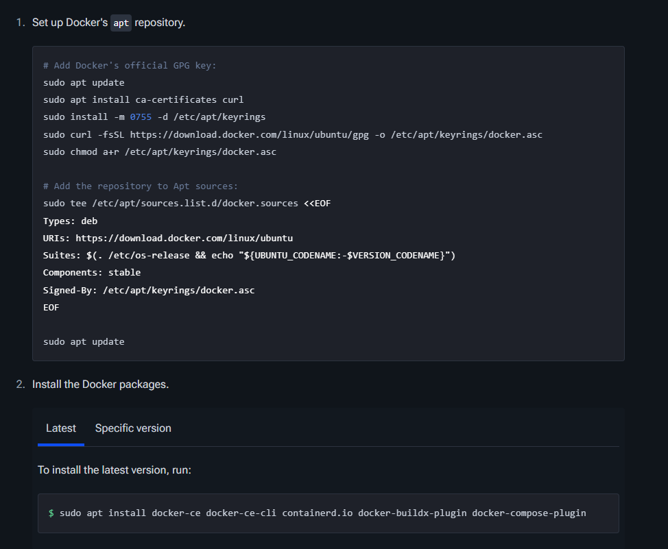
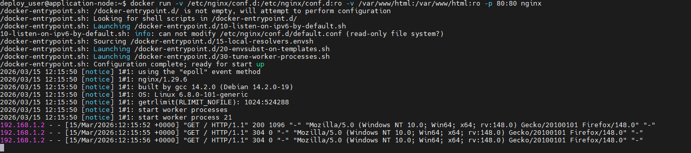
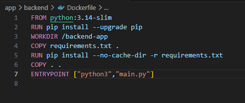
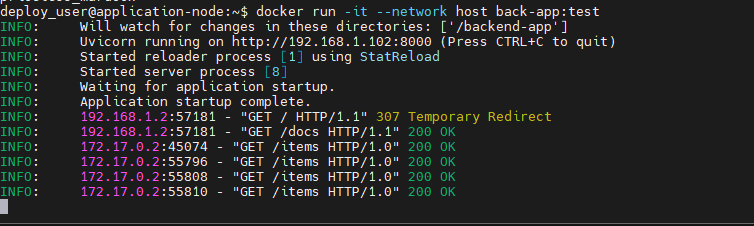
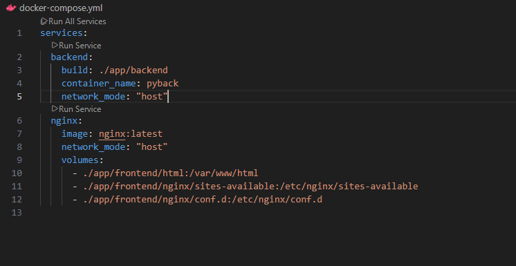
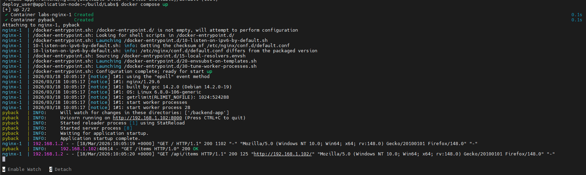
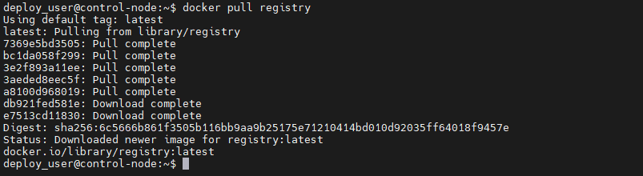
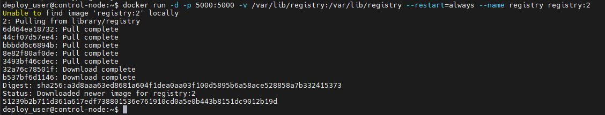
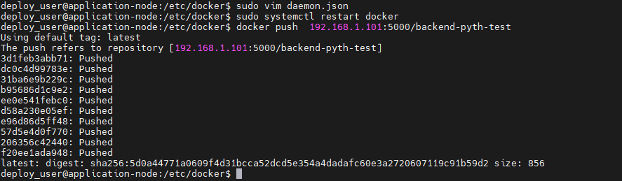
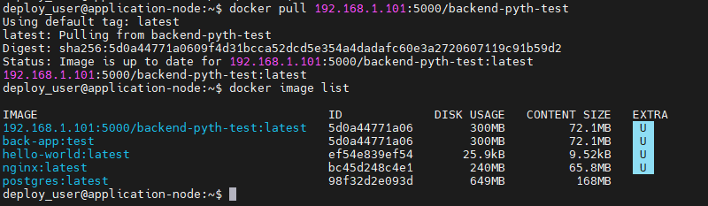

## Лабораторная работа 4  
#### Docker, Dockerfile, docker-compose, docker-registry.   
## Знакомство с Docker  
Первым дело я установил докер по официальному мануалу на сервер:  
  
Далее я установил образ NGINX и запустил контейнер с ним:  
  
Первый полностью рабочий и запущенный контейнер позади, далее нужно написать Dockerfile для всего что я могу обернуть в контейнер в своем проекте, а после собрать из этого образы, потом на один из серверов я хочу поставить docker-registry и реализовать приватное хранилище образов.  
## Dockerfile  
Написанный докерфайл под бэкенд на питоне:  
  
Итак, все благополучно запустилось, backend и nginx в разных контейнерах. В ходе запуска контейнеров я столкнулся с проблемой связи этих контейнеров, пришлось пользоваться флагом --network host чтобы контейнеры пользовались сетью хоста, а не внутренней сетью докера, в будущем это вероятно пофиксится в docker-compose.  
  
## docker-compose
Вот так выглядит файл docker-compose.yml:  
  

А вот выдача при запуске:  
  
Таким образом мы создали, настроили и запустили сразу несколько контейнеров с помощью одного файла. Это некое начало в методологии IaC.
Я все еще прокидываю сеть контейнеров через хост, потому что не могу понять как связать backend контейнер с базой данных на хосте. 
## docker-registry  
Теперь поставим на уже другой сервер наш приватный репозиторий докер образов - docker registry, для этого нужно спуллить официальный образ с докер хаба:  
  
Далее мы прописываем  
```
docker run -d -p 5000:5000 -v /var/lib/registry:/var/lib/registry --restart=always --name registry registry:2
```
здесь мы запускаем контейнер registry, он будет работать на порту 5000 который прокинут с контейнера на порт хоста, так же мы примонтировали папку контейнера к папке хоста и поставили автоматический запуск контейнера с запуском демона докера  
  
Далее нам на машине с которой мы пушим образ нужно:  
создать файл /etc/docker/daemon.json с таким содержимым:  
```
{
"insecure-registries":["ip-addr:5000"]
}
```
Теперь нужно создать tag образа, который мы пушим вот такого формата:  
```
docker tag <image_name> <ipaddr-registry>:5000/<image_name_in_registry>
```
Вот что вышло у меня:  
  
теперь попробуем спулить этот образ
  
Отлично, на этом обзор докера заканчивается, если я буду использовать какие-либо новые фишки или техники докера в следующих частях - я явно опишу это там.
## P.s.
Dockerfile вполне можно было разобрать чуть больше и сделать акцент на бестпрактис.
как правильно работать с бд в данном случае я так и не понял.
docker-registry вполне можно было настроить много лучше - добавить авторизацию, сделать сеть с доменами, чтобы не использовать ip:5000/image а использовать domen/image, но мое дело разобрать все на базовом уровне и без больших затрат по времени.
В общем здесь я получил первоначальный опыт работы с докером и некоторые базовые знания, дальше уже нужно набивать руку и повторять за более опытными пользователями/админами.
