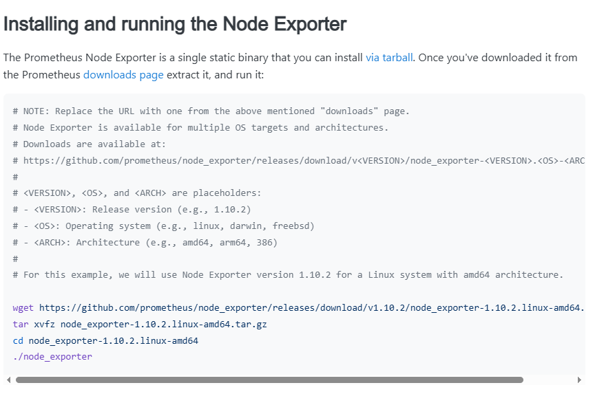
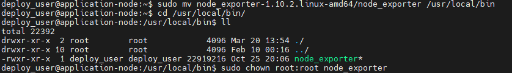
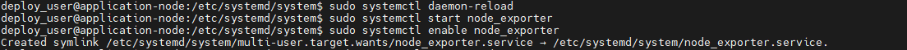
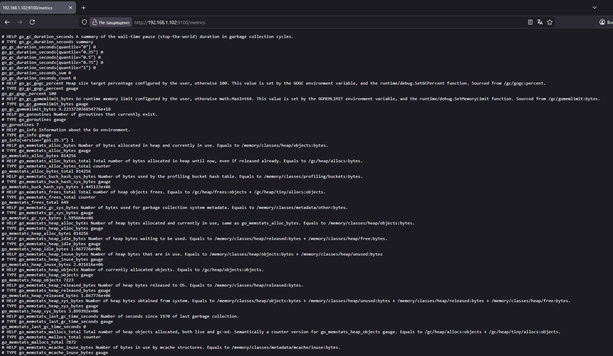
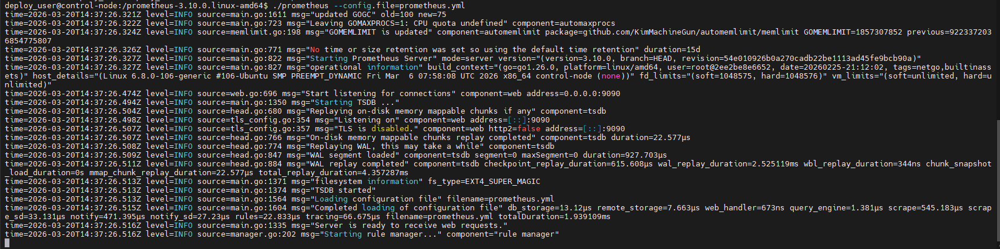
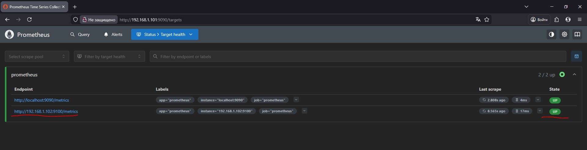
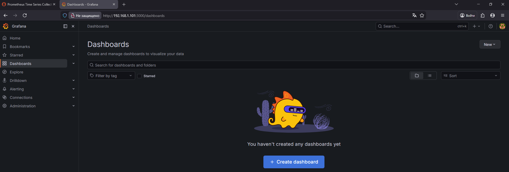
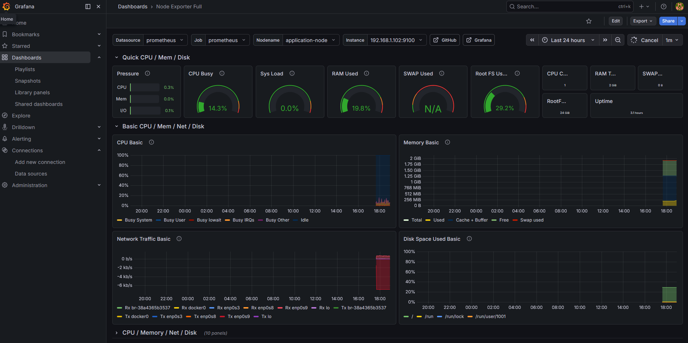

## метрики Grafana+Prometheus  
В моем девопс роадмап следующий пункт это мониторинг и метрики. Графана это веб дашборд, прометеус это агент мониторинга, который собирает данные с экспортеров и отдает в дашборд.  
Я сразу буду готовиться к масштабируемой модели, где графана и прометеус стоят на одной машине, а экспортеры на нескольких.  
## Node exporter  
Первым делом с официального гайда прометеуса скачиваем архив экспортера на условную воркер ноду  
  
Далее мы переносим бинарник экспортера в /usr/local/bin создаем для него пользователя и меняем права  
  
Далее нам нужно создать файл .service по пути /etc/systemd/system/service_name.service чтобы запускать его в качестве системного сервиса, а в файл запишем следующее  
```
[Unit] 
Description=Node Exporter 
After=network.target 
[Service]
User=node_exporter 
Group=node_exporter 
Type=simple 
ExecStart=/usr/local/bin/node_exporter 
[Install] 
WantedBy=multi-user.target
```
Теперь просим systemctl принять новый конфиг, стартануть сервис и добавить его в автозапуск  
  
Теперь проверяем наши метрики в веб интерфейсе по адресу ip_addr:9100/metrics:  
  

## Prometheus
Теперь на очереди сам агент, который будет забирать текущие логи  
```
sudo wget https://github.com/prometheus/prometheus/releases/download/v3.10.0/prometheus-3.10.0.linux-amd64.tar.gz
tar xvfz prometheus-3.10.0.linux-amd64.tar.gz
```
после распаковки нужно поменять .yml файл с настройками, нужно добавить новый хост таргета:
```
static_configs:
    - targets: [‘localhost:9090’, ‘192.168.1.102:9100’]
```
запускаем прометеус и смотрим уже его веб интерфейс на наличие нашего таргета  
  
прометеус работает, а веб интерфейс находится по адресу ip_addr:9090/targets
  

## Grafana
Скачиваем и устанавливаем графану
```
wget https://dl.grafana.com/grafana/release/12.4.1/grafana_12.4.1_22846628243_linux_amd64.tar.gz
tar -zxvf grafana_12.4.1_22846628243_linux_amd64.tar.gz

```
далее запускаем бинарник по пути /grafana/bin/grafana-server и в браузере заходим в веб интерфейс по адресу ipaddr:3000, при входе нас попросят ввести данные, для первого раза это admin:admin, после входа пароль сразу попросят сменить  
  
теперь во вкладке connections/data cources добавим наш source, и добавим визуализацию в дашборд, импортируем чужой уже настроенный дашброд по uid 1860 и вот что мы имеем
  
