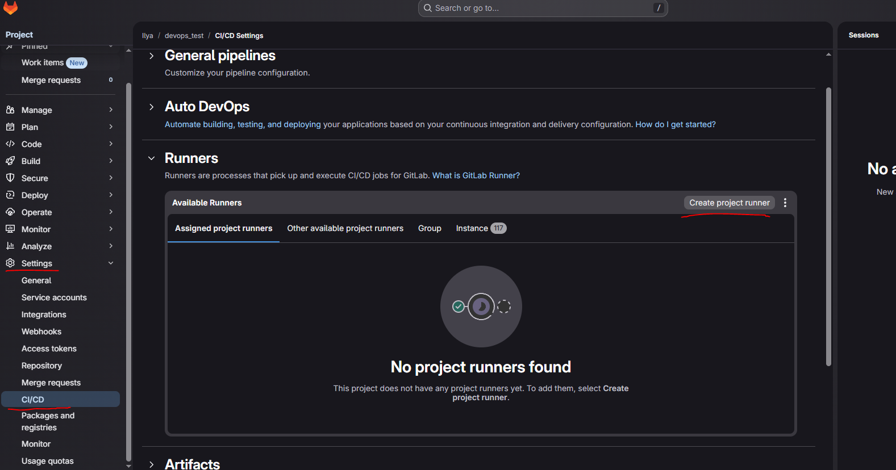
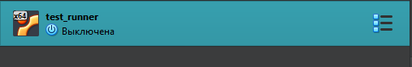
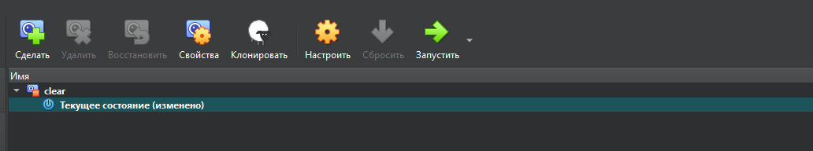
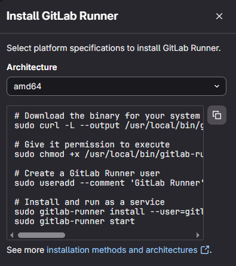
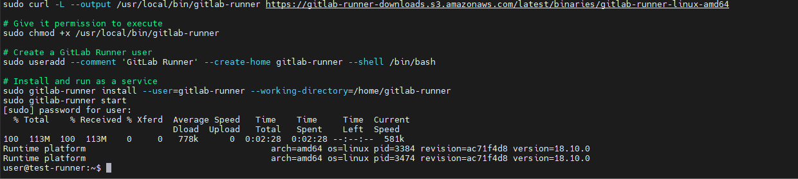
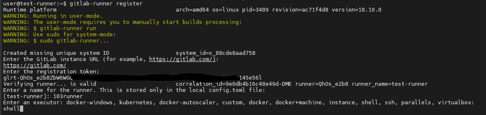
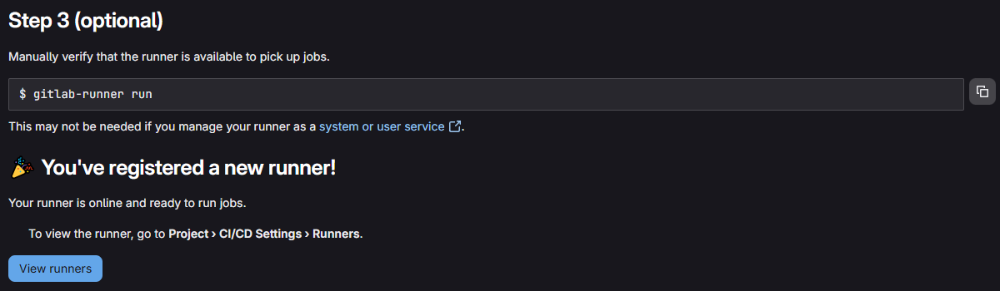
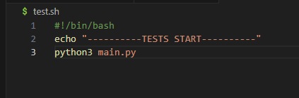
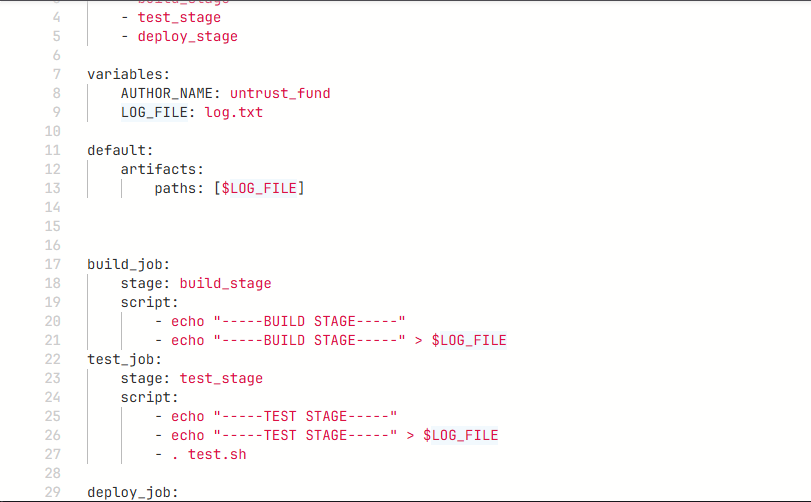
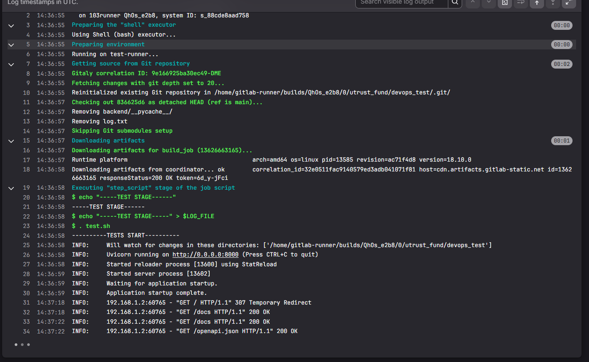

## GitLab, CI/CD
Первое что я решил сделать - это установить свой собственный раннер.   
  
Для этого я создам отдельную машину в Vbox.
  
и создам снимок чистой версии
  
Далее настрою сеть, ssh и установлю нужные зависимости и обновления.
Gitlab предоставляет полные инструкции для регистрации собственного runnera
  
  
После установки gitlab runner, нужно провести регистрацию
  
Здесь у нас спросили url для регистрации, мне нужен был дефолтный, далее нужно было указать идентификатор раннера - его выдают на сайте гитлаба, локальное название машины(оно будет в логах) и исполняющий сервис - у меня это просто shell  
  
После регистрации запускаем раннер и уже на сайте видим что все получилось  
Далее нужно создать некую полезную нагрузку - добавить в репозиторий прошлые наработки  
Напишем маленький тест для работы приложения:  
  
Все что он делает это запускает бэкенд файл.  
Далее нужно написать первый пайплайн:   
  
небольшой пайплайн, вся нагрузка в котором это запуск нашего .sh файла, который запустит api на сервере, чтобы мы смогли увидеть что пайплайн проходит именно на нашем раннере  
  
пайплайн работает, все запускается на моем раннере, сайт доступен. Отлично.  
Теперь нужно усовершенствовать сам пайплайн и попробовать деплой через gitlab