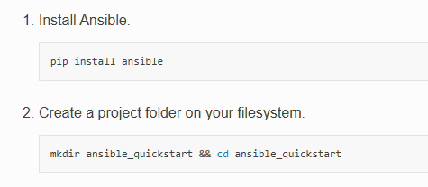
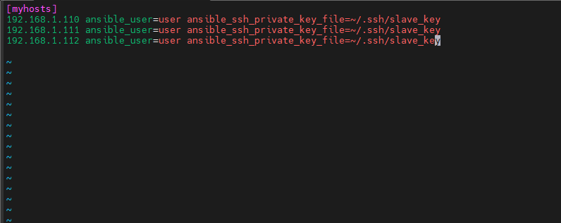
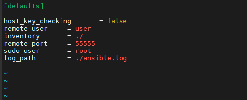
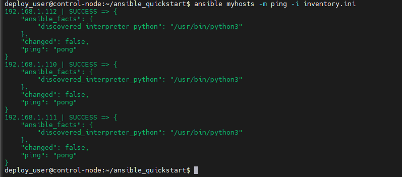
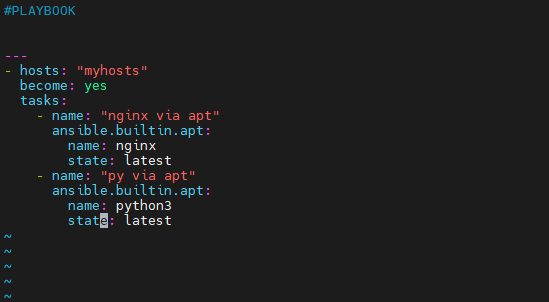
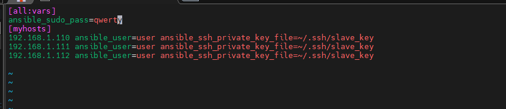
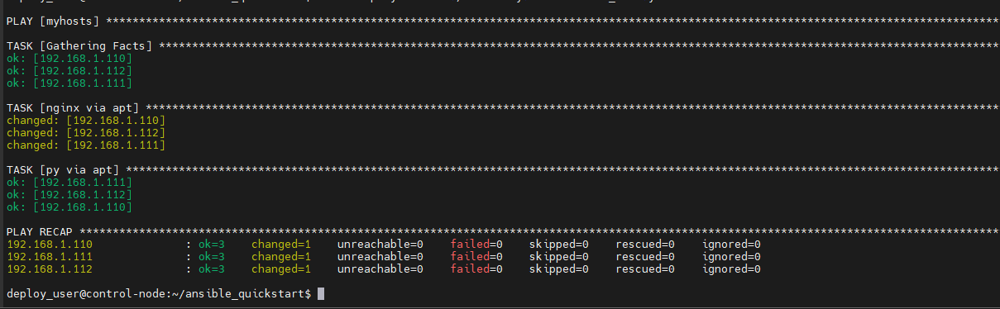
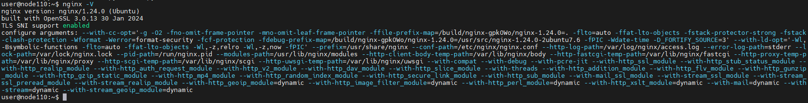

## Ansible
Для начала установим ansible на управляющий сервер и сделаем все что от нас требуют в официальной документации  
  
Далее нужно создать файл inventory.ini в созданной директории, содержимое этого файла:  
  
здесь записаны адреса управляемых машин, юзер по которому идет подключение и путь к shh ключу  
далее нужно создать ansible.cfg файл вот с таким наполнением:  
  
и запустить команду   
```
ansible myhosts -m ping -i inventory.ini
```  
вот что мы получаем:  
   
первичный запуск прошел успешно, теперь нужно написать первый плейбук и роль.
## Playbook
Теперь нужно приступить к плейбукам, вот как выглядит плейбук.yml файл:
  
чтобы управляющий сервер мог выполнять команды от имени админа мне нужно было прописать судо пароль в файле инвентаризации(inventory.ini)  
  
Вот что он выдает при запуске(здесь он выполнил только одну таску, далее я переписал чтобы все работало):  
  
Далее я проверил на сервере 110 действительно ли установился nginx  
  

## Roles
